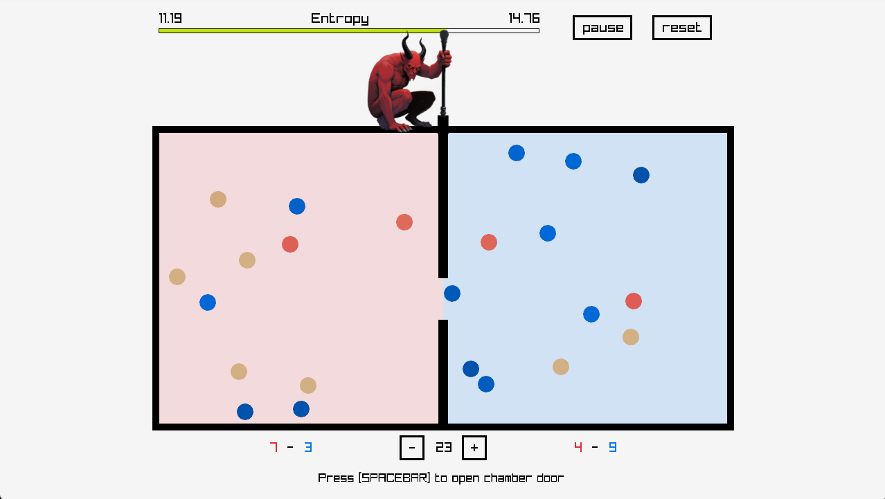

# Maxwell's Demon

Lower the entropy of the system.

## Controls

Spacebar to open chamber door.

## Itch.io

## Build Command Examples

For full build instructions see: [https://github.com/proc0/raystart](https://github.com/proc0/raystart)

Substitute `./build.sh` for `.\build.ps1` on Windows.

#### Build Desktop Release

`./build.sh --release`

#### Build Desktop Debug and Run

`./build.sh --run`

#### Build Web Debug and Run

`./build.sh --web --run`

#### Build Web Release

`./build.sh --web --release`

#### Build Desktop Debug with CMake arguments

`./build.sh --verbose`

#### Build Desktop Release, with CMake arguments and run

`./build.sh --release --run --verbose`

## Resources

- [Raylib](https://github.com/raysan5/raylib)
- [Raylib Web build instructions](<https://github.com/raysan5/raylib/wiki/Working-for-Web-(HTML5)>)
- [Emscripten](https://emscripten.org)

## Build Script Usage

<pre>
build{.sh|.bat} [--web] [--release] [--run] [OPTIONS]

--web: build for web using Emscripten
--release: build for release
--run: run executable after build
OPTIONS: additional options passed to CMake build command
</pre>
